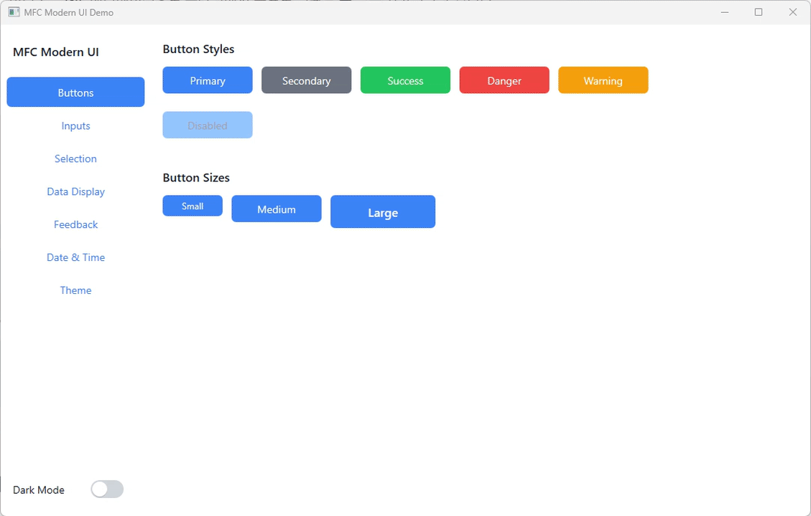

# MFC Modern UI

Windows MFC 애플리케이션을 위한 모던 UI 컴포넌트 라이브러리입니다.

Direct2D 기반의 하드웨어 가속 렌더링과 다크/라이트 테마를 지원하며, 기존 MFC 프로젝트에 쉽게 통합할 수 있습니다.



## 특징

- **Direct2D 렌더링**: 하드웨어 가속을 통한 부드러운 애니메이션과 안티앨리어싱
- **테마 시스템**: 다크/라이트 모드 자동 전환 지원
- **애니메이션**: 상태 변화에 따른 부드러운 색상 전환 효과
- **모던 디자인**: 둥근 모서리, 그림자, 호버 효과 등 현대적인 UI 요소
- **쉬운 통합**: 기존 MFC 프로젝트에 헤더 파일 포함만으로 사용 가능

## 요구 사항

- Visual Studio 2019 이상
- Windows 10 SDK
- MFC (Microsoft Foundation Classes)
- Direct2D, DirectWrite

## 설치

1. `MFCModernUI` 폴더를 프로젝트에 추가
2. 프로젝트 속성에서 추가 포함 디렉터리 설정
3. 메인 헤더 파일 포함:

```cpp
#include "MFCModernUI.h"
using namespace MFCModernUI;
```

## 컴포넌트

### 기본 컨트롤

| 컴포넌트 | 설명 |
|----------|------|
| `CMButton` | 다양한 스타일(Primary, Secondary, Outline, Ghost)을 지원하는 버튼 |
| `CMLabel` | 여러 텍스트 스타일(H1~H4, Body, Caption)을 지원하는 라벨 |
| `CMEdit` | 플레이스홀더, 유효성 검사 상태를 지원하는 텍스트 입력 |
| `CMCheckBox` | 애니메이션 체크 표시가 있는 체크박스 |
| `CMRadioButton` | 그룹 선택을 위한 라디오 버튼 |
| `CMPanel` | 컨테이너 패널 |
| `CMProgressBar` | 진행률 표시 바 |

### 입력 컨트롤

| 컴포넌트 | 설명 |
|----------|------|
| `CMToggleSwitch` | iOS 스타일의 토글 스위치 |
| `CMComboBox` | 드롭다운 선택 상자 |
| `CMSlider` | 값 범위 선택을 위한 슬라이더 |
| `CMSpinner` | 숫자 입력을 위한 스피너 |

### 데이터 표시

| 컴포넌트 | 설명 |
|----------|------|
| `CMListView` | 목록 표시 뷰 |
| `CMTreeView` | 계층적 데이터를 위한 트리 뷰 |
| `CMDataGrid` | 테이블 형태의 데이터 그리드 |
| `CMTabCtrl` | 탭 컨트롤 |

### 날짜/시간/색상

| 컴포넌트 | 설명 |
|----------|------|
| `CMDatePicker` | 날짜 선택기 |
| `CMTimePicker` | 시간 선택기 |
| `CMColorPicker` | 색상 선택기 |

### 피드백

| 컴포넌트 | 설명 |
|----------|------|
| `CMNotification` | 토스트 알림 (Info, Success, Warning, Error) |
| `CMModal` | 모달 다이얼로그 |
| `CMTooltip` | 툴팁 |
| `CMContextMenu` | 컨텍스트 메뉴 |

## 사용 예제

### 버튼 생성

```cpp
CMButton m_button;

// 버튼 생성
m_button.Create(_T("Click Me"), WS_CHILD | WS_VISIBLE,
    CRect(10, 10, 150, 50), this, IDC_MY_BUTTON);

// 스타일 설정
m_button.SetButtonStyle(ButtonStyle::Primary);

// 클릭 핸들러 설정
m_button.SetClickHandler([](void* ctx) {
    AfxMessageBox(_T("Button clicked!"));
}, nullptr);
```

### 텍스트 입력

```cpp
CMEdit m_edit;

// 에디트 생성
m_edit.Create(WS_CHILD | WS_VISIBLE,
    CRect(10, 70, 300, 105), this, IDC_MY_EDIT);

// 플레이스홀더 설정
m_edit.SetPlaceholder(_T("Enter text..."));

// 텍스트 변경 핸들러
m_edit.SetTextChangedHandler([](void* ctx, const CString& text) {
    // 텍스트 변경 처리
}, nullptr);
```

### 테마 전환

```cpp
// 다크 모드 활성화
CMThemeManager::GetInstance().SetDarkMode(true);

// 테마 토글
CMThemeManager::GetInstance().ToggleTheme();

// 현재 테마 확인
bool isDark = CMThemeManager::GetInstance().IsDarkMode();
```

### 알림 표시

```cpp
// 성공 알림
CMNotificationManager::GetInstance().ShowSuccess(
    _T("저장되었습니다."), 3000);

// 오류 알림
CMNotificationManager::GetInstance().ShowError(
    _T("오류가 발생했습니다."), 5000);
```

## 프로젝트 구조

```
MFCModernUI/
├── MFCModernUI/           # 라이브러리 소스
│   ├── MFCModernUI.h      # 통합 헤더
│   ├── CMControlBase.*    # 기본 컨트롤 클래스
│   ├── CMThemeManager.*   # 테마 관리자
│   ├── CMAnimationManager.* # 애니메이션 관리자
│   ├── CM*.h/cpp          # 각 컴포넌트
│   └── ...
├── MFCModernUI.Demo/      # 데모 애플리케이션
└── MFCModernUI.sln        # Visual Studio 솔루션
```

## 빌드

1. Visual Studio에서 `MFCModernUI.sln` 열기
2. 솔루션 빌드 (Ctrl+Shift+B)
3. `MFCModernUI.Demo` 프로젝트를 시작 프로젝트로 설정
4. 실행 (F5)

## 라이선스

MIT License

## 버전

- 현재 버전: 1.0.0
